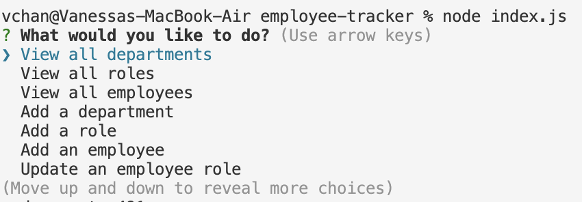

# employee-tracker

## Description
This application is a content management system used to view, interact with, and udpate (CRUD) employee information using Node.js, Inquirer, Console Table and MySQL. 

## Installation
To install the application locally, ensure that Node.js is installed. Clone repository and run the installation script ```npm install```. Connect to MySQLWorkbench through application index.js file. Create the database in the workbench using the schema.sql file and seed the database in the workbench using the seed.sql file in the db folder. Use script ```node index.js``` to start the application.

## Usage

